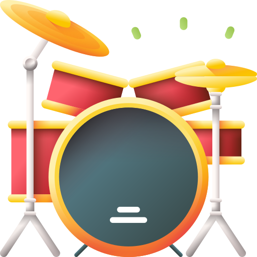

# Drum Kit Project
## Dive into the project
<em>(Tap on drum icon to view the project)</em>

## Overview:
This Drum Kit project is a web-based application built using HTML, CSS, and JavaScript. It emulates a virtual drum kit, allowing users to play different drum sounds by pressing corresponding keys on their keyboard or by clicking on virtual drum pads displayed on the screen.

## Features:
- **Keyboard Interaction:** Users can trigger drum sounds by pressing specific keys on their keyboard, corresponding to each drum pad.
- **Mouse Interaction:** Alternatively, users can click on the drum pads using their mouse to produce sounds.
- **Visual Feedback:** Upon interaction, the drum pads respond with visual feedback, enhancing the user experience.
- **Multiple Drum Sounds:** The application provides a variety of drum sounds, allowing users to create their beats by combining different sounds.
- **Responsive Design:** The application is designed to be responsive, ensuring compatibility across various devices and screen sizes.

## Technologies Used:
- **HTML:** Used for structuring the drum kit interface and elements.
- **CSS:** Used for styling the visual presentation of the drum pads and overall layout.
- **JavaScript:** Used for implementing the interactive functionality of the drum kit, including event handling and sound playback.

## Usage:
1. **Keyboard Interaction:**
   - Press the corresponding keys on your keyboard to play different drum sounds.
2. **Mouse Interaction:**
   - Click on the drum pads using your mouse to produce sounds.

## Learnings:
Through the Drum Kit project, I gained valuable insights into various aspects of web development:
- **HTML Structure:** Designing the drum kit interface using HTML taught me about structuring elements and creating interactive components.
- **CSS Styling:** Applying CSS styles to the drum pads and layout allowed me to enhance the visual presentation and user experience.
- **JavaScript Event Handling:** Implementing keyboard and mouse interactions in JavaScript helped me understand event handling and DOM manipulation.
- **Audio Playback:** Incorporating sound playback functionality improved my understanding of working with audio files in JavaScript.

## Contribution:
Contributions to the project are welcome! Feel free to fork the repository, make improvements, and submit pull requests to suggest new features or enhancements.

## License:
This project is open-source under the [MIT License](LICENSE), allowing for collaboration and distribution.
